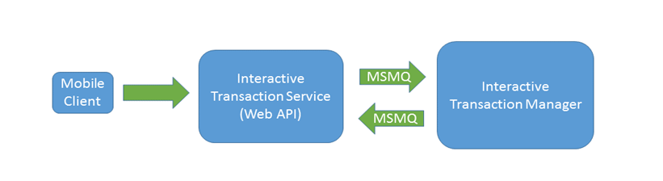

## Market Place Adapter Pattern

The topmost layer of the Market Place architecture, the Client layer, is by design the most volatile, i.e. that layer is the most subject to change from customer to customer, deployment to deployment, and over time. This volatility can be due to a variety of factors, including the client device form factor (e.g. screen size) and compute resources; no one client implementation can satisfy all possible situations.

Client device resource constraints in particular can preclude some client types from directly accessing the Market Place Manager layer, the entry point services for all clients. This is particularly true of handheld devices where weight, battery life and heat production may influence the features supported by the client’s operating system, particularly in communications with external entities. In such clients TCP/IP and HTTP/HTTPS are often the default communications protocols available (due to the ubiquitous availability of the Internet).

To accommodate such client-access limitations, Market Place requires some sort of adapter at the Manager boundary. This adapter can be viewed as part of the client, and its principal job is to act as a bridge between the communications constraints of the client and that of any associated Manager services. For example when the client interaction is over HTTP/HTTPS protocols, the corresponding adapter will typically present a REST-like API view of corresponding Market Place Manager interfaces to the client.

The adapter or communications bridge pattern is an important factor in keeping enterprise level deployments flexible. An adapter need not run on the same hardware platform instances as the Market Place Managers, thus providing great flexibility in addressing horizontal scale issues.

## Interactive Transaction Manager

An adapter can interact with any Manager or Managers, though design considerations specific to the client will typically bind the adapter to a particular Manager for the required client workflow.




Figure 1 - Interactive Transaction Manager and Adapter


The Interactive Transaction Manager (ITM) and its associated adapter is a standard feature of Market Place. In this feature the ITM adapter runs as a service and, together with ITM, provides the ability for third party applications to use Market Place services to perform price checks, queue busting, and store associate transaction and tender processing in a similar manner to a traditional Point-Of-Service (POS) system. Although the adapter protocol is REST-like, operationally any required business transaction state is maintained by the ITM on a per client basis.

ITM currently runs in-store and supports store-owned devices only. Any application using the ITM adapter for sales activities must follow similar business rules / security requirements to the full POS device, e.g. the operator signs on / off using Market Place User Management services (via the ITM) and the client device is configured in the system in the same way as a full POS (selling device).  However, applications that do not require full transactional security (and sign-on), such as a customer driven price check, are also supported.


## INTERACTIVE TRANSACTION MANAGER INTERFACE
The following sections define the REST API for ITM. All URI’s below are relative to the service base address:

http://localhost:9000/fujitsu/its

**Currently only http is supported – it’s a small change to support https.**

**All REST requests to the ITM service must include two headers:**
    
- One named “registerid” which contains the register number of the device
    
- One named clienttime which contains the current client date / time offset formatted in windows by DateTimeOffset.Now.LocalDateTime.ToString("O")

All methods will return one of 4 HttpStatusCodes:

**HttpStatusCode.OK** if the method worked.

**HttpStatusCode.Unauthorized.** The associated message will indicate the reason for manager authorization. If the application supports manager authorization then it should prompt to sign on the manager indicating the reason for manager authorization with the returned message.

**HttpStatusCode.NotAcceptable.** The action failed. The returned message indicates the reason for failure.

**HttpStatusCode.ExpectationFailed.** The action requires a reason code. The response body will include an array of ReasonCodeDetails structures defining the available reason codes:

**Response Body:** An array of
```csharp
public class ReasonCodeDetails
{
/// <summary>
/// Value of reason code
/// </summary>

public int Value;
/// <summary>
/// Description of reason code in the operators language
/// </summary>

public string Description;
}
```
The client application should either give up or show the list and let the operator select one. Then the original request should be repeated with the selected reason code Value in the request parameters.

